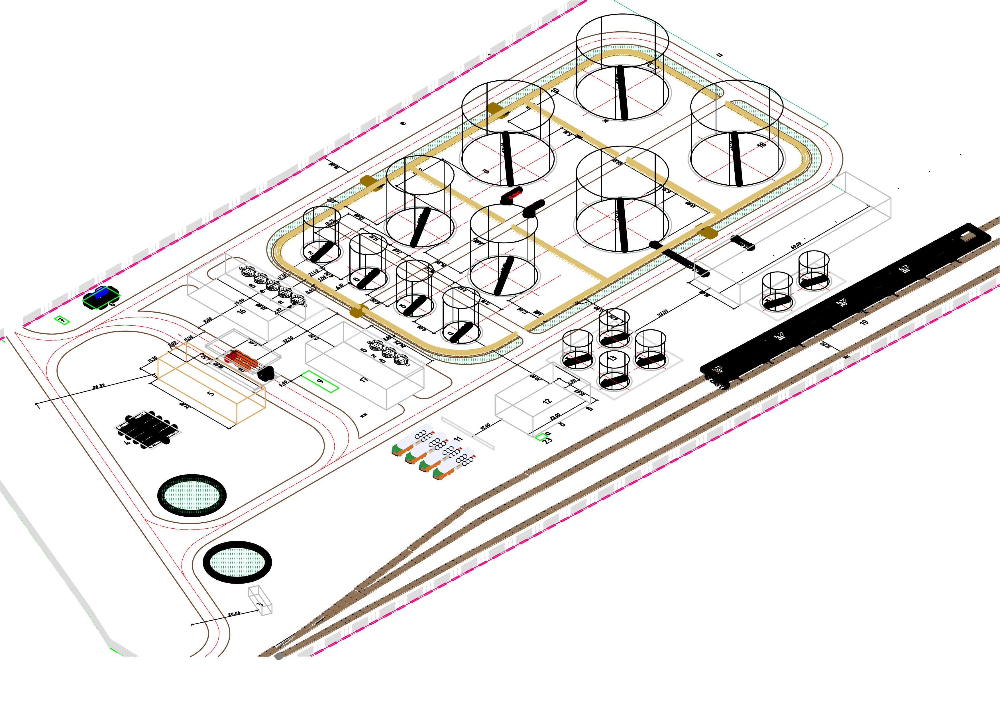
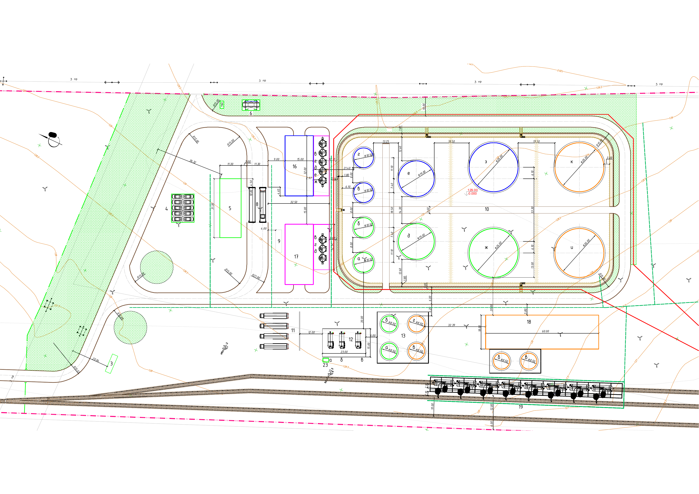
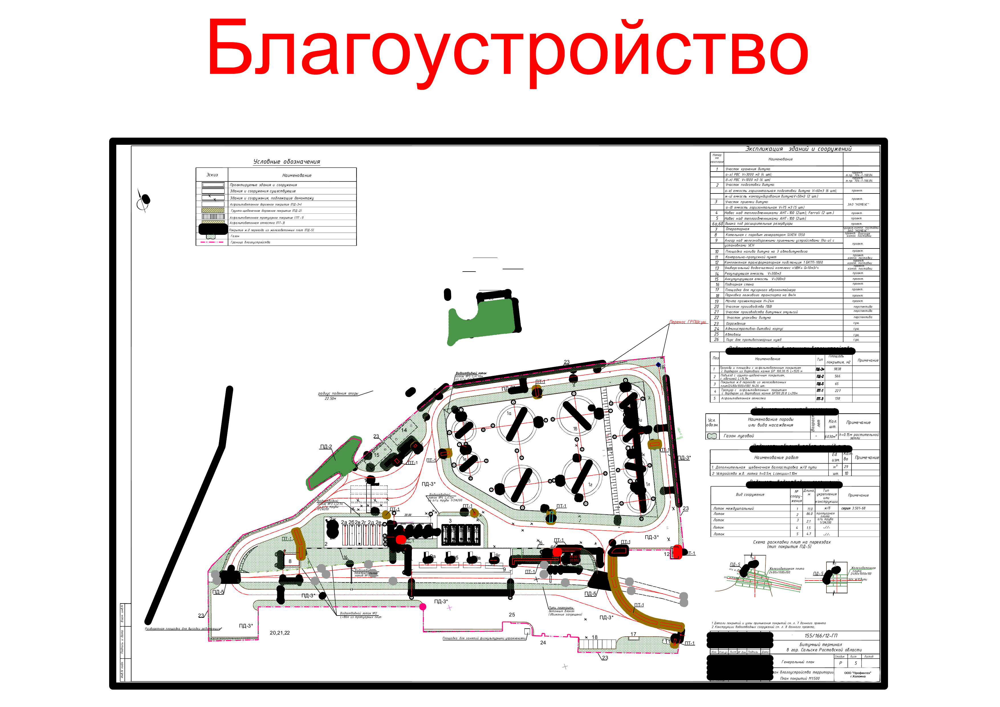
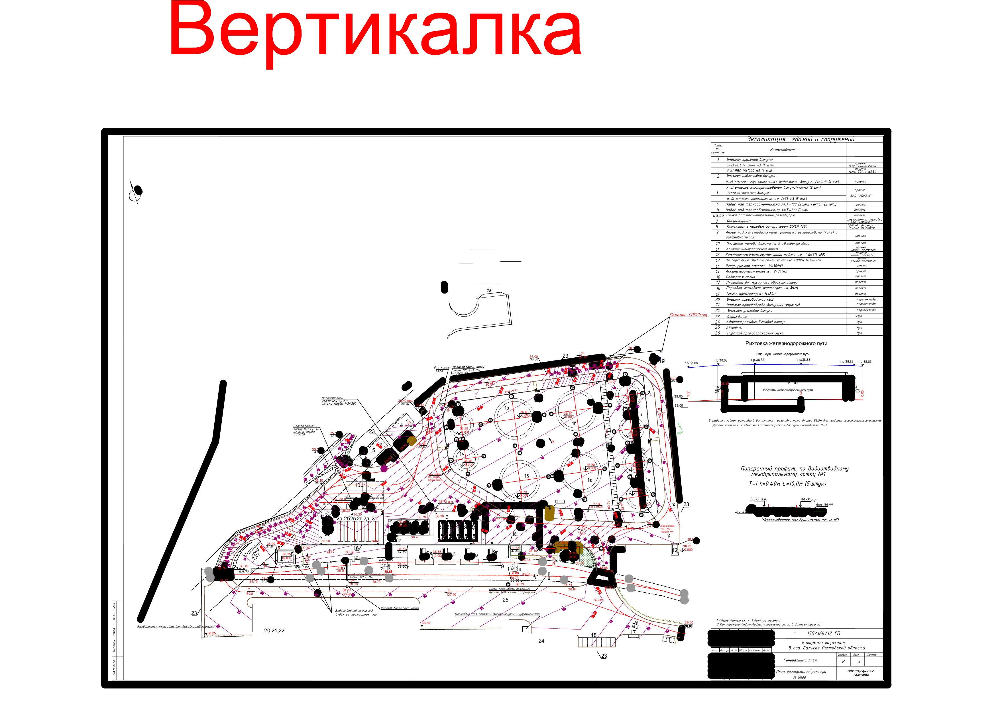
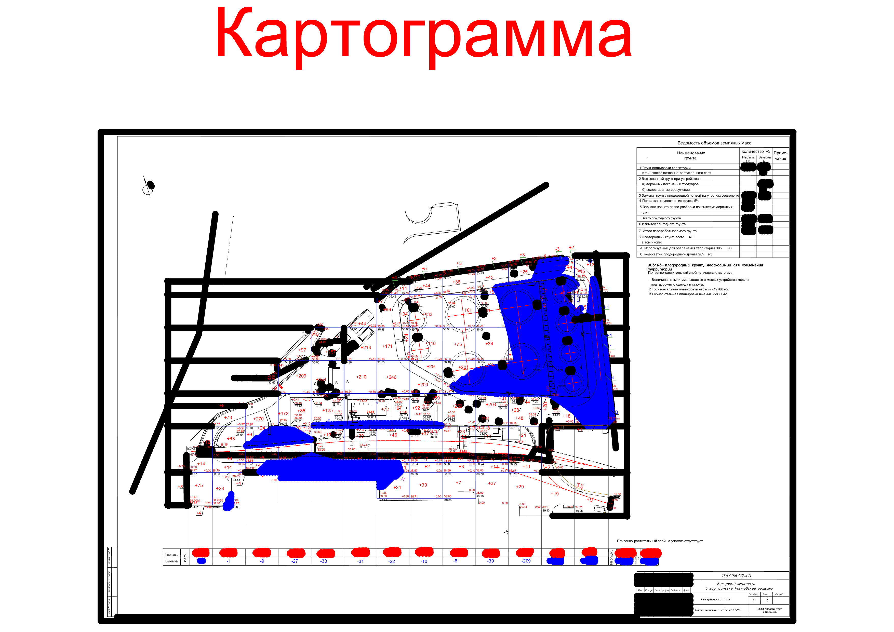
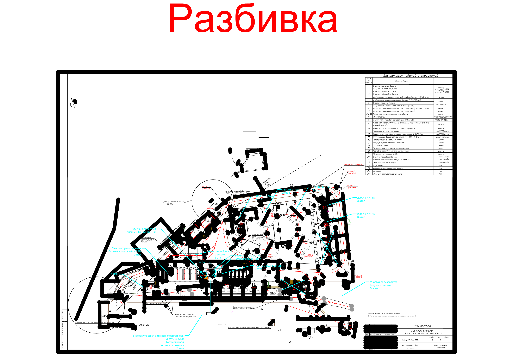
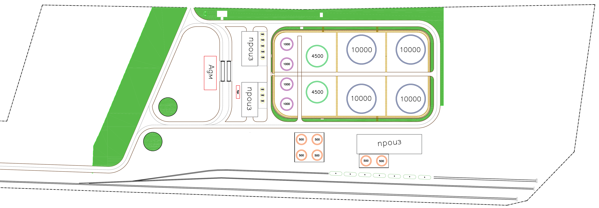
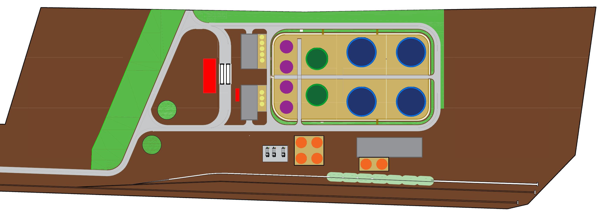

---

В данной ветке предоставлены описание к исходным данным и как они изменялись на протяжении всей работы: 

---

  
<h2>⚙️ Структура данных </h2>

  <ul>
  	    <li><b>info_data.ipynb</b> - Информация по классам</li>
        <li><b>examples_of_source_images</b> - примеры исходных изображений <code>до</code> преобразования</li>
        <li><b>last_data</b> - изображения и разметка после <code>первого</code> преобразования</li>
	      <li><b>new_data</b> - изображения и разметка после <code>второго</code> преобразования, было добавлено больше цвета к ихображениям, а также новые теги</li>
	</ul>

  
<h2>⚙️ Тэги</h2>

  <ul>
        <li><b>buildings administration/office</b> - здание администрации или офиса</li>
        <li><b>production</b> - здание производства</li>
  	    <li><b>VST V=10000m3</b> - Резервуар вертикальный стальной для нефтепродуктов объёмом <code>10000м3</code></li>
        <li><b>VST V=5000m3</b> - Резервуар вертикальный стальной для нефтепродуктов объёмом <code>5000м3</code></li>
        <li><b>VST V=4500m3</b> - Резервуар вертикальный стальной для нефтепродуктов объёмом <code>4500м3</code></li>
	      <li><b>VST V=3000m3</b> - Резервуар вертикальный стальной для нефтепродуктов объёмом <code>3000м3</code></li>
        <li><b>VST V=2000m3</b> - Резервуар вертикальный стальной для нефтепродуктов объёмом <code>2000м3</code></li>
        <li><b>VST V=1000m3</b> - Резервуар вертикальный стальной для нефтепродуктов объёмом <code>1000м3</code></li>
        <li><b>VST V=500m3</b> - Резервуар вертикальный стальной для нефтепродуктов объёмом <code>500м3</code></li>
        <li><b>VST V=100m3</b> - Резервуар вертикальный стальной для нефтепродуктов объёмом <code>100м3</code></li>
        <li><b>HST V=75m3</b> - Резервуар <code>горизонтальный</code> стальной для нефтепродуктов объёмом <code>75м3</code></li>
        <li><b>HST V=60m3</b> - Резервуар <code>горизонтальный</code> стальной для нефтепродуктов объёмом <code>60м3</code></li>
        <li><b>VST V=50m3</b> - Резервуар вертикальный стальной для нефтепродуктов объёмом <code>50м3</code></li>
        <li><b>HST V=50m3</b> - Резервуар <code>горизонтальный</code> стальной для нефтепродуктов объёмом <code>50м3</code></li>
        <li><b>railway</b> - железные пути</li>
        <li><b>port</b> - порт</li>
	</ul>

# Исходные схемы и их преобразования

## Исходные схемы

Исходные схемы имеют множество `дополнительной информации`, а также `разный формат`. 

Ещё одной проблемой исходных данных было `наличие большого количество белого фона`, который при добавлении шума замещал большую часть изображения, из-за чего модель не могла понять что ей надо сгенерировать (это было исправлено после `попытки №2`)

Примеры исходных схем

||
|:--:|:--:|
| *3Д изображение* | *К схеме добавлен рельеф территории* |
||
| *Ненужное выделение каждого объекта благоустройства* | *Множество мелких уточнений не несущих сильной нагрузки* |
||
| *Карта россыпи грунта* | *Уточнения по этапам строительства и другой подобной информации* |

На большинстве их этих изображений также можно было заметить жирные чёрные полосы, которые также мешают пониманию предназначения данных схем.

## Преобразования

### Начальный этап
В связи с описаными ранее проблемами было принято решение преобразовать все имеющиеся схемы к единому формату, убрав при этом всю лишнюю информацию.

Для изменения схем было использовано приложение `Autodesk AutoCAD 2022`. Где изменялся цвет, упрощались объекты, а также добавлялась некая доп информация (которая в дальнейшем оказалось не нужной)

||
|:--:|:--:|
| *Было* | *Стало* |

### Второй этап
В ходе обучения модели из `Attempt 2` было выяснено что для обучения диффузионной модели требуется `большее количестве цветов на изображении`, потому что в итоге модель `учится рисовать шум, а не исходное изображение`, поэтому было принято решение `второй раз переформатировать схемы`.

||
|:--:|:--:|
| *Было* | *Стало* |

Опыты над этими данными будут происходить в папке `Attempt 3`